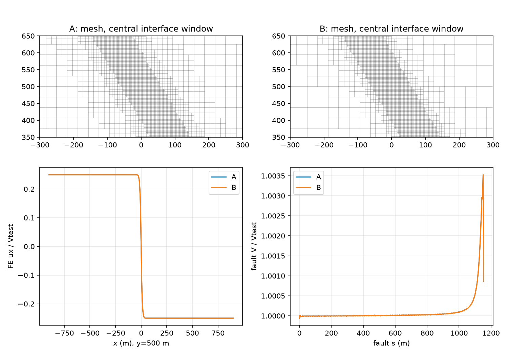
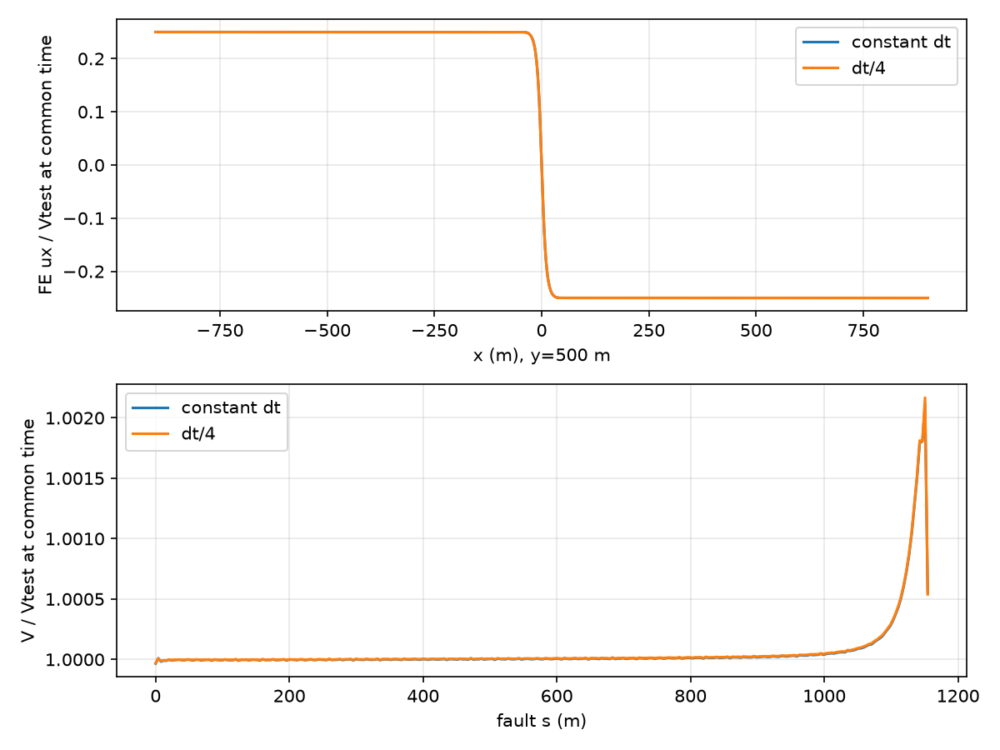
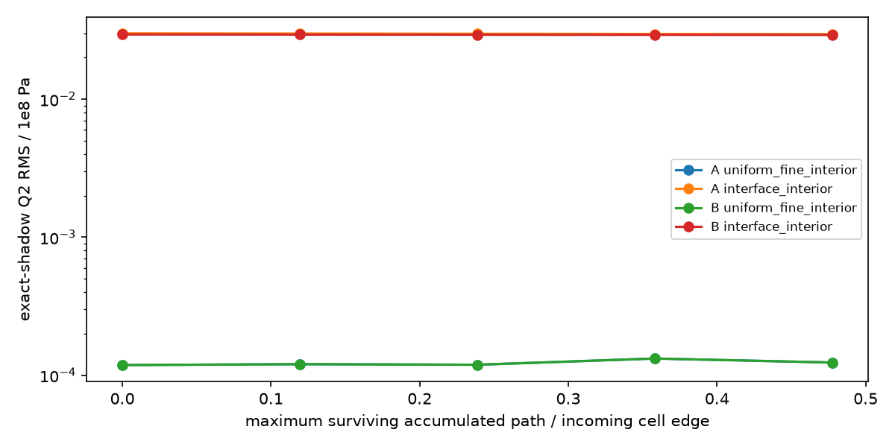

# Section 5: bounded local velocity, mesh and transport comparison

Section 4 was accepted and committed as **1678949c2**. This separate pass is for
review. Core mechanics, production defaults, ownership and checkpoint formats
are unchanged. The old unbuffered graded-completion failure remains open.

## What was tested

The [predeclared plan](PLAN.md) extends Section 5 as requested. The maintained
plugin sources have an OFF-by-default diagnostic build option; it selects the
functional rate and exposes A/B only in that isolated build. Both use the live
profile/geometry and frozen-H initializer, native mesh balancing, 4x4 particles,
12/24 density management, native limited LLS/continuous Q2, AMG, full bottom
loading, mechanical normal feedback and the 20 m filter. No prescribed fault
slip or alternate coupled solver is used.

Local box 2x1 km, dip60, ell20, h_fine=3.90625 m, fixed mesh. Both protect
max(2 ell,R+2 h_fine) and the same boundary strip enclosing current completion
admission. This diagnostic buffer does **not** qualify the unbuffered production
mesh. A uses exterior slope 1/4. B recovers slope 1/2 and the 12500 m cap from
`tests/bp3_length_scale_mesh.cc`, outside the same protected band. That large cap
is inactive locally; both realized h_max=125 m. The larger historical domain and
its cap are not tested here.

Uniform strengthening a=.025,b=.015,Dc=.008, Vtest=Vp=Vinit=.001 m/s. The live
friction law supplies compatible Theta=8 s and shear plus the retained BP3
radiation damping. Initial Maxwell history is zero. The material's artificial
initial interval is .05 s, matching the selected physical step. The 29 s pilot
passed; both coupled runs then accepted 20 fixed .05 s steps to 1 s without
cutback. Production tolerances and state/safety restrictions remain active.

| Coupled case | Cells | Stokes DoFs | Particles | Wall seconds | Krylov total |
|---|---:|---:|---:|---:|---:|
| A | 12,656 | 120,071 | 202,496 | 244.49 | 503 |
| B | 11,732 | 111,843 | 187,712 | 225.14 | 473 |

B saves 7.9% wall time in this single pair. Peak child RSS was about 1.17/1.10
million KiB respectively; these are runner child high-water values, not a sum
of all-rank RSS. Counts stay 16/cell with no coupled births/losses. Stress increments
are nonzero (final |tau| max about 40.23 kPa). Max V=.00100353 m/s, sampled bulk
speed=.000500059 m/s, S=.0062721, |delta lnTheta|<=2.064e-5. The imposed .05 s
maximum-step cap is active; the unchanged state/RSF restrictions do not cut it.
Max Cp=6.405e-6 and surviving Ap=1.281e-4: fast V did not create significant
particle motion in this short safety-limited run.

## Matched response and timestep branch

At t=1 s, A/B fault-V RMS/max differences are 4.23e-11 / 3.09e-10 m/s;
RMS/Vtest=4.23e-8, far below the predeclared provisional 1% engineering screen.
FE velocity component RMS/max differences at identical physical probes are
3.79e-10 / 1.91e-9 m/s. Filtered weak-Q1 normal RMS/max differences are
.0728/.4009 Pa. Maximum slip difference is 1.18e-10 m. See
[matched locations](results/matched_locations.csv) and [all metrics](results/comparison.json).
Weak projected tractions are labeled as such; separate matched QP samples retain
raw and actual friction-consumed normal stress (matched QP RMS/max difference
.0461/.0976 Pa at the final time). All actual sampled normals stay
compressive, and fresh linear residuals meet their unchanged targets.

The implemented Maxwell relation is beta=exp(-G dt/eta),
eta_ve=-eta*expm1(-G dt/eta), **not backward Euler**. After the accepted step9
checkpoint (.45 s), the existing bounded restart hook reduces only the pending
interval, preserving accepted time, old dt, all physical/particle/RNG history.
The constant-dt replay takes two steps; the dt/4 branch takes eight to .55 s.
Initial bulk, particle and RNG snapshots are byte-identical. Replay fault and
FE probes match uninterrupted A bitwise. The formatted final build is checked
against this same reference.

At the common time, V RMS/max differences are 5.29e-9 / 5.02e-8 m/s (maximum
.00502% of Vtest); bulk component RMS/max 1.49e-9 / 2.81e-8 m/s. Integrated probe
displacement differs by at most1.08e-8 m, slip by5.17e-9 m, and particle positions
by 1.96e-8 m. Particle membership and H are unchanged. Stress components differ
by up to1.31 kPa; different temporal discretizations need not produce identical
history. The dt*u probe integral uses the solved right-endpoint mechanical
velocity; it is not labeled as RK2 particle advection. Actual RK2 displacement
and path are measured independently from retained particle positions. eta_ve changes 1.601906016e9 ->4.00476504e8 Pa s, beta rounds to1 on both,
and Stokes preconditioners are rebuilt. Filtered-Q1 normal max difference 6.15 Pa.
No substantial velocity/roughness amplification is observed before appreciable
motion. Velocity differences are immaterial against the declared screen, so no
extra constant-small-step reference was launched. This does not prove arbitrary
variable-timestep history accuracy or distinguish every temporal-error component.

Live mu_V and mu_Theta are retained. The frozen local normal sensitivity
mu/(sigma*mu_V+eta_d) is about 5.35e-10 (m/s)/Pa; A/B normal differences give a
local scale up to 2.14e-10 m/s. This is a sensitivity estimate, not an inversion
of weak projected traction into nodal V or a prediction of the full discrete
coupled response. Fresh mechanical residual checks remain the discrete gate.

Actual FE probes use 2 m spacing along y=250,500,750 m. Endpoint fault regions
(first/last 200 m) are reported separately. The 8 m centered second difference
is a roughness measure, not an exact error; its whole-transect value includes
the physical loading transition. Raw curves are retained, with separately
reported exterior uniform/interface windows and fault-interior chords.




## Independent transport and newly exposed lifecycle limit

Transport uses U=(1,.6) m/s for 1.6 s, four .4 s steps, with
q=1e8[1+.1 sin(pi(x-t)/64) cos(pi(y-.6t)/64)] Pa and tensor[q,-q,q/2].
The field is defined at inflow. Exact-position shadow components refresh before
**native** LLS and simulator continuous-Q2 projection/constraints; stored Maxwell
history stays separate. Comparisons use actual Gauss3 coordinates. No coupled
BP3 history is overwritten. Boundary cells are separated from interior results.

Retained paths reach 0.478 incoming-cell edges. Two-rank A/B each record 3,758
level-crossing events and 654 births. Exact shadow particle error is zero;
newborn H exactly matches the shared initializer, retained H is unchanged, and
all H remains positive. Tensor constraints and finite reconstructed values are
checked. Stored newborn/history error is reported separately from shadow error.

| Q2 shadow RMS / 1e8 Pa | A startup -> final | B startup -> final |
|---|---:|---:|
| Uniform fine interior | .0001187 -> .0001238 | .0001187 -> .0001238 |
| Interface interior | .02993 -> .02956 | .02938 -> .02915 |
| Uniform coarser interior | .02971 -> .02918 | .04457 -> .04370 |

These are volume-weighted statistics over each realized region, whose areas and
cell sizes differ. They are not matched-cell errors or proof that every interface
is worse. The fine region's small increase establishes motion sensitivity of
reconstruction; coarse/interface errors already dominate before motion for this
128 m wavelength. B increases coarse-region error while its short fault response
remains nearly identical. Stored and shadow histories are not conflated. At the final transport state,
newborn/retained stored-history maximum errors are 324.2/208.5 kPa; populations
remain within 12--24. Exact shadow samples isolate reconstruction from these
already accumulated stored-history errors.



**Separate unresolved lifecycle issue:** max-ID-based native allocation reuses a
retired ID after outflow, reproduced on one and two ranks. In A, ID 202495 moves
out from (156.56171875,999.99171875); a new particle then receives that ID near
(-155.92447917,.32552083) on two ranks. Active IDs remain unique. ID-only tracking
initially misreported this as 134 cell widths. The final diagnostic also matches
the known flow trajectory within a geometric floating-point bound; a reused ID
starts a new birth/path. Records are retained. Production allocation is unchanged.

This exposes an existing gap in BP3's next-ID-threshold birth counters and
ID-keyed H audit: a birth below the previous next-ID threshold can be missed or
mistaken for a survivor. The regular coupled pair has no births and is unaffected;
prior retry/restart evidence does not qualify this outflow/reuse situation. This
is not an MPI-only defect, nor is it fixed by diagnostic tracking. A bounded
allocation/audit lifecycle correction with outflow, retry and restart coverage
is the recommended next task.

## Verification, scope and reproduction

**116/116 focused checks pass.** Total additional simulation time, including
pilots, retained failed launches and diagnostic reruns, is **826.9 s (13.8 min)**;
compilation is separate. [Checks](results/checks.json), [commands/logs](evidence), and
[artifact hashes](results/final_artifacts.json) retain successful and failed
attempts. The core binary and accepted Section-4 library hashes are unchanged.
The default production build also compiles with the diagnostic option OFF,
and contains no local probe/policy symbols. Release builds instantiate registered 2D/3D classes; runtime is 2D only. The focused
Section-3/4 compatibility, dip/order and nonzero-history retry/RNG/restart evidence
is reused; the unbuffered resolved 45-degree gate remains unqualified. No repeated
seed campaign, tolerances adjustment or production/server allocation occurred.

Initial harness failures (missing native particles postprocessor, separate clock
plugin unresolved symbol) were corrected without physical changes. An analysis
check initially matched the printed `Cut back factor` setting as a cutback; it
now checks the actual repeat/failure messages and accepted dt sequence. All logs
are retained. Output label reuse is rejected before overwriting evidence.

Build from the repository root, using the qualified GCC12.4/OpenMPI5.0.6 environment:

```sh
cmake -S benchmarks/reconstructed_fault/bp3/plugin \
  -B benchmarks/reconstructed_fault/bp3_local_tests/build \
  -DAspect_DIR="$PWD/build-refactor-r6b" -DCMAKE_BUILD_TYPE=Release \
  -DBP3_LOCAL_OSCILLATION_TEST=ON
cmake --build benchmarks/reconstructed_fault/bp3_local_tests/build -j 3
# Configure/build transport and clock subdirectories with the same Aspect_DIR.
python3 benchmarks/reconstructed_fault/bp3_local_tests/run_cases.py A 2
python3 benchmarks/reconstructed_fault/bp3_local_tests/run_cases.py B 2
python3 benchmarks/reconstructed_fault/bp3_local_tests/prepare_branch.py
python3 benchmarks/reconstructed_fault/bp3_local_tests/run_cases.py A-replay 2
python3 benchmarks/reconstructed_fault/bp3_local_tests/run_cases.py A-small-dt 2
python3 benchmarks/reconstructed_fault/bp3_local_tests/run_cases.py transport-A 2 final
python3 benchmarks/reconstructed_fault/bp3_local_tests/run_cases.py transport-B 2 final
python3 benchmarks/reconstructed_fault/bp3_local_tests/run_cases.py transport-A-serial 1 final
python3 benchmarks/reconstructed_fault/bp3_local_tests/analyze.py
```

Existing outputs/logs must be preserved: reruns need isolated paths and labels.
Standalone [A](inputs/A.prm), [B](inputs/B.prm), [small-dt branch](inputs/A-small-dt.prm)
and transport PRMs contain all settings; only their fault.txt is model data.
Preparation scripts are conveniences, never model runtime dependencies.

**Decision:** the historical large velocity oscillation was not reproduced;
only short stable fast sliding is qualified. B is a modest-cost diagnostic
candidate with larger exterior history error, not an accepted production
replacement. Keep A and its protected buffer as the reference. Neither unbuffered
production completion nor long-term inflow/ID lifecycle is qualified for a server
first-event run. The [candidate policy](CANDIDATE.md) is separate for review. No server job,
production refinement change or next stage was started.
